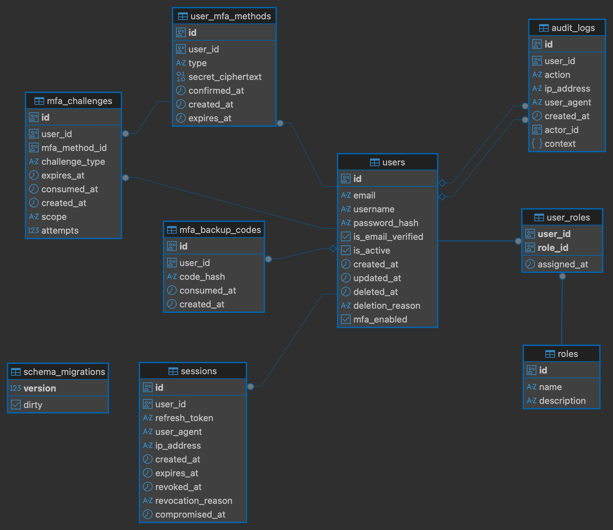

# Auth Service

I came up with the idea of creating this Auth Service as a way to plug and play whenever I have an actual SaaS business. For it to be used as one service that'll produce Kafka events and orchestrate authentication across other future services. I was always ambitious with this project, and wanted to use all the available cutting edge tools (hopefully without getting cut). I'll briefly mention the tools used in this project. The only big IF case here is that I have a grpc server, which I need a grpc-gateway for. 

## Overview

The Auth Service is responsible for:

- User authentication
- Session management
- Multi-factor authentication (TOTP, backup codes)
- Step-up challenges
- Token issuance (access & refresh tokens)

It is designed to be used in a microservices architecture.

## Architecture

- Language: Go
- Transport: gRPC
- Database: PostgreSQL
- Observability: OpenTelemetry + Jaeger
- Containerization: Docker

## Features

- Password-based authentication
- TOTP-based MFA
- Backup codes
- Step-up authentication challenges
- Challenge attempt limiting
- Token rotation
- Distributed tracing

## Database Design



## First Time Setup

1. install dependencies

```bash
make tools
```
2. Start dependencies:

```bash
docker-compose up -d
```

3. Run migrations:

```bash
make run-migrations
```

4. shut down dependencies:

```bash
docker-compose down
```

## Run Locally

```bash
make run
```

## Configuration

| Variable | Description | Required |
|----------|-------------|----------|
| DATABASE_URL | PostgreSQL connection string | Yes |
| JWT_SECRET | Signing key for tokens | Yes |
| TOTP_ISSUER | Issuer name for authenticator apps | Yes |

## Future Improvements

- Trusted devices
- WebAuthn support
- Rate limiting at API gateway
- Redis-backed challenge cache
- Email verification
- Password reset
- Device management UI
- Remember-me logic
- Emit auth events
- gRPC Endpoint for Step-up MFA
- K8s Kustomize

## Infrastructure

- gRPC
- golang
- github workflows
- docker-compose

## Feature Walkthrough

Auth service is versioned via protobuff. currently it is v1.
Client cmd for grpc testing

## User Registration

The `RegisterUser` operation is responsible for securely creating a new user account while enforcing validation, uniqueness, and auditability.

### Flow

1. **Input Validation**
   - Username, email, and password are validated.
   - Invalid inputs are rejected before any database interaction.

2. **Uniqueness Check**
   - The service verifies that the username and email are not already in use.
   - Duplicate accounts are rejected with a clear client error.

3. **Password Policy Enforcement**
   - Password strength rules are validated.
   - Only compliant passwords proceed to hashing.

4. **Secure Password Hashing**
   - The password is hashed using a secure one-way hashing algorithm.
   - Plaintext passwords are never stored or logged.

5. **User Creation**
   - The new user record is persisted with the hashed password.

6. **Audit Logging**
   - An audit log entry is created capturing:
     - User ID
     - Action type (account creation)
     - IP address
     - User agent

7. **Observability**
   - The entire operation is wrapped in a distributed trace span.
   - Errors and relevant attributes are recorded for monitoring and debugging.

---

### Security Guarantees

- Passwords are never stored in plaintext.
- Duplicate usernames or emails are prevented.
- Account creation is auditable.
- Sensitive information is not exposed in error responses.
- All critical steps are traceable via distributed tracing.

---

### Design Notes

- Validation occurs before persistence to reduce unnecessary database load.
- Audit logging is executed as part of the request lifecycle.
- Structured logging is used for operational visibility.

## User Login

The `Login` operation authenticates a user using email and password, and conditionally enforces multi-factor authentication (MFA) before issuing tokens.

### Flow

1. **Feature Flag Validation**
   - Login is blocked if refresh token functionality is disabled.
   - Prevents issuing incomplete or unsupported authentication flows.

2. **User Lookup**
   - The user is retrieved by email.
   - If the user does not exist, a generic invalid credentials error is returned.
   - The system does not reveal whether the email is registered.

3. **Password Verification**
   - The provided password is compared against the stored hash.
   - Failed comparisons return a generic invalid credentials error.
   - Failed attempts are logged for monitoring.

4. **Account State Validation**
   - Deleted accounts are rejected.
   - Inactive accounts are rejected.
   - The client is not informed of the specific reason (prevents account enumeration).

5. **MFA Enforcement**
   - If the user has confirmed MFA methods:
     - A step-up challenge is created.
     - Tokens are not issued yet.
     - The client must complete MFA verification.
   - If no MFA methods are configured:
     - Login proceeds directly to token issuance.

6. **Token Issuance**
   - On successful authentication (and no MFA required):
     - Access and refresh tokens are generated.
     - Audit logging records the login event.

7. **Observability**
   - The entire operation is wrapped in a trace span.
   - Key attributes and failure states are recorded for monitoring.

---

### Security Guarantees

- Email enumeration is prevented.
- Account status (deleted/inactive) is not exposed to clients.
- Passwords are verified using secure hash comparison.
- MFA is enforced before token issuance when configured.
- Login attempts are logged for operational visibility.
- Token issuance can be feature-flag controlled.

---

### MFA-Aware Authentication Design

The login process is MFA-aware by design:

- Authentication and authorization are separated.
- Password verification does not automatically grant tokens.
- When MFA is enabled, a challenge must be completed before the session is established.
- This allows the same challenge mechanism to be reused for future step-up authentication scenarios.

---

### Design Notes

- The system prioritizes generic error responses to prevent information leakage.
- Token generation is deferred until all authentication requirements are satisfied.
- The challenge model allows future expansion to support multiple MFA methods.
- Distributed tracing enables end-to-end visibility of authentication flows.

## Complete Login MFA

The `CompleteLoginMFA` operation finalizes a login attempt that requires multi-factor authentication (MFA). It verifies the provided MFA code and issues tokens if successful.

---

### Flow

1. **Challenge Verification**
   - The MFA challenge associated with the login attempt is verified and consumed.
   - Ensures that challenges are single-use and enforces attempt limiting.
   - Invalid or expired codes result in an error, preventing token issuance.

2. **User Retrieval**
   - The user associated with the challenge is fetched from the database.
   - Missing or deleted users trigger a generic invalid credentials error to prevent account enumeration.

3. **Token Issuance**
   - Upon successful MFA verification, access and refresh tokens are generated.
   - Audit logging records the MFA login event for traceability.

4. **Observability**
   - The operation is part of a distributed trace.
   - Key events and failures are recorded for monitoring and debugging.

---

### Security Guarantees

- MFA challenges are single-use and tied to a specific login attempt.
- Invalid codes do not reveal whether the user exists.
- Tokens are only issued after successful MFA verification.
- Audit logs capture the MFA login event for accountability.

---

### Design Notes

- The service decouples MFA verification from password validation to support step-up authentication.
- Finalizing login through a dedicated method ensures consistent token issuance and audit logging.
- Distributed tracing provides full visibility into MFA login attempts and failures.


## Refresh Token Rotation

The `RefreshToken` operation issues a new access token and rotates the refresh token while enforcing strict session integrity and compromise detection.

This flow is designed to prevent replay attacks and detect token theft.

---

### Flow

1. **Feature Flag Validation**
   - The operation is blocked if refresh tokens are disabled.
   - Prevents partial or unsupported authentication flows.

2. **Session Lookup**
   - The session is retrieved using the provided refresh token.
   - If no session is found, a generic invalid credentials error is returned.
   - The system does not reveal whether the token exists.

3. **Session Integrity Checks**

   The following conditions immediately invalidate the request:

   - **Session already compromised**
   - **Session expired**
   - **Session revoked**

4. **Token Reuse Detection (Replay Protection)**

   If a revoked refresh token is reused:

   - The event is treated as a potential attack.
   - All sessions for the user are revoked and marked as compromised.
   - An audit log entry is created.
   - The request is rejected.

   This protects against stolen refresh token reuse.

5. **User Validation**
   - The associated user is retrieved.
   - Deleted accounts are rejected.
   - The client is not informed of account status.

6. **Refresh Token Rotation**
   - A new refresh token is generated.
   - The existing session is atomically rotated:
     - Old session is revoked (rotation reason recorded).
     - New refresh token replaces the old one.
     - Metadata (IP address, user agent) is recorded.

7. **Access Token Issuance**
   - A new access token is generated.
   - User roles and identity claims are embedded.

8. **Observability**
   - The entire operation is wrapped in a distributed trace span.
   - Security-relevant states are recorded.

---

### Security Guarantees

- Refresh tokens are single-use.
- Reuse of revoked tokens triggers full session compromise handling.
- Session expiration is enforced server-side.
- Deleted users cannot obtain new tokens.
- All token rotation events are auditable.
- Replay attacks are mitigated.

---

### Session Security Model

The refresh flow implements **rotation-based session security**:

- Every refresh invalidates the previous token.
- Reuse of an old token is treated as compromise.
- Compromise triggers global session revocation.
- Metadata (IP, user agent) is tracked for auditing and investigation.

This model aligns with modern secure authentication practices used in production SaaS systems.

---

### Design Notes

- Token rotation is performed at the persistence layer to ensure consistency.
- Generic error responses prevent token enumeration.
- Audit logging captures suspicious activity.
- Distributed tracing enables end-to-end visibility of session lifecycle events.

## Change Password

The `ChangePassword` operation allows a user to update their password while enforcing strong security policies and revoking active sessions to prevent unauthorized access.

---

### Flow

1. **User Context Validation**
   - The user ID is retrieved from the request context.
   - Requests without a valid user context are rejected.

2. **Password Validation**
   - The new password is checked against the password policy.
   - Invalid passwords are rejected before any database operations.

3. **User Retrieval**
   - The user is fetched from the database.
   - Deleted or missing users result in a generic invalid credentials error to prevent account enumeration.

4. **Old Password Verification**
   - The current password is compared against the stored hash.
   - If the old password does not match, the request is rejected.

5. **Prevent Password Reuse**
   - The new password is compared against the current password.
   - Reusing the old password is prohibited and triggers a specific `PasswordReuseError`.

6. **Password Hashing**
   - The new password is securely hashed using a one-way algorithm before storage.
   - Plaintext passwords are never persisted.

7. **Update and Session Revocation**
   - The password is updated in the database.
   - All active sessions for the user are revoked to prevent unauthorized access with old credentials.
   - Revocation reason is logged for auditing.

8. **Audit Logging**
   - An audit log entry is created capturing:
     - User ID
     - Action type (password change)
     - IP address
     - User agent

9. **Observability**
   - The entire operation is wrapped in a distributed trace span.
   - Errors and key attributes are recorded for monitoring.

---

### Security Guarantees

- Old passwords must match before allowing a change.
- Password reuse is prohibited.
- Active sessions are revoked after a password change.
- Deleted or inactive accounts cannot change passwords.
- Audit logging ensures traceability.
- Distributed tracing provides end-to-end visibility.

---

### Design Notes

- Password validation occurs before any persistence to reduce unnecessary database operations.
- Session revocation is coupled with password update to prevent session hijacking.
- Generic error responses prevent leaking account state.
- Structured logging provides operational visibility without exposing sensitive data.

## Logout

The `Logout` operation revokes the user's active session associated with a given refresh token, ensuring the session cannot be reused and capturing the event for auditing.

---

### Flow

1. **Session Lookup**
   - The session corresponding to the provided refresh token is retrieved.
   - If no session exists (already logged out or invalid token), the operation is treated as successful to avoid leaking session state.

2. **Session Revocation**
   - The session is marked as revoked with the reason `Logout`.
   - Revocation prevents any further use of the refresh token or associated access tokens.

3. **Audit Logging**
   - An audit log entry is created capturing:
     - User ID
     - Action type (logout)
     - IP address
     - User agent
   - Failures in audit logging are logged but do not block logout completion.

4. **Observability**
   - The entire operation is wrapped in a distributed trace span.
   - Status and any operational issues are recorded for monitoring.

---

### Security Guarantees

- Logout revokes the refresh token and any associated session.
- Reusing a revoked or invalid refresh token is silently ignored to prevent session enumeration.
- Audit logs capture the logout event for traceability.

---

### Design Notes

- The logout process is idempotent: multiple calls with the same refresh token are safe.
- Session revocation ensures that access tokens cannot be refreshed after logout.
- Structured logging and distributed tracing provide operational visibility without leaking sensitive information.

## Delete User

The `DeleteUser` operation soft deletes a user account, revokes all active sessions, and records the action for auditing while enforcing role-based authorization.

---

### Flow

1. **Authorization Check**
   - The actor's roles are retrieved from the request context.
   - Only users with the `CanDeleteUser` permission are allowed to perform deletions.
   - Unauthorized attempts return a `ForbiddenError` without revealing target user information.

2. **Input Validation**
   - The deletion reason and optional note are validated.
   - Invalid input is rejected before any database operations.

3. **User Deletion and Session Revocation**
   - The target user is deleted in the database.
   - All active sessions associated with the user are revoked with the reason `UserDeleted`.
   - If the user does not exist or is already deleted, a `BadRequestError` is returned.

4. **Audit Logging**
   - An audit log entry is created capturing:
     - Target User ID
     - Actor ID (who performed the deletion)
     - Action type (`DeleteUser`)
     - IP address and user agent
     - Deletion reason and optional note
   - Failures in audit logging are logged but do not rollback the deletion.

5. **Observability**
   - The operation is wrapped in a distributed trace span.
   - Status and key attributes are recorded for monitoring.

---

### Security Guarantees

- Only authorized users can delete accounts.
- Active sessions are revoked immediately upon deletion.
- Audit logs capture the actor, target, and context of deletion for accountability.
- Generic errors prevent leaking user existence information.

---

### Design Notes

- Deletion and session revocation are executed atomically to prevent stale sessions.
- Role-based access control ensures separation of duties.
- Audit logs provide full traceability for compliance and security investigations.
- Structured logging and distributed tracing enable operational visibility without exposing sensitive data.

## Enroll MFA Method

The `EnrollMFAMethod` operation allows a user to enroll a new multi-factor authentication (MFA) method, such as TOTP, while enforcing uniqueness, expiration cleanup, and secure secret handling.

---

### Flow

1. **User Context Retrieval**
   - The user ID and email are extracted from the request context.
   - Requests without valid user context are rejected.

2. **Method Type Validation**
   - The requested MFA method type is validated.
   - Invalid types result in a `ValidationError`.

3. **Check Existing Enrollment**
   - The service checks whether the user already has an active method of the same type.
   - Duplicate enrollment is rejected with a `BadRequestError`.

4. **Cleanup Expired/Unconfirmed Methods**
   - Any expired or unconfirmed MFA methods of the same type are deleted to avoid conflicts.

5. **TOTP Key Generation**
   - A new TOTP key is generated for the user using their email as the identifier.
   - The provisioning URI is derived for setup in an authenticator app.

6. **Secret Encryption**
   - The TOTP secret is encrypted before being persisted.
   - Plaintext secrets are never stored.

7. **Persistence**
   - The new MFA method is created in the database with the encrypted secret and metadata.

8. **Response**
   - Returns the newly created MFA method and a setup URI for the user to configure their authenticator.

9. **Observability**
   - The operation is wrapped in a distributed trace span.
   - Key events and errors are recorded for monitoring.

---

### Security Guarantees

- MFA secrets are encrypted at rest.
- Duplicate MFA enrollment is prevented.
- Expired/unconfirmed methods are cleaned up to prevent orphaned secrets.
- Sensitive information (like raw secrets) is never exposed in logs or responses.
- Traceability is provided for enrollment events.

---

### Design Notes

- The setup URI can be used to display a QR code for authenticator apps.
- Cleanup of expired/unconfirmed methods ensures that only valid MFA secrets exist for each user.
- Distributed tracing allows observability of enrollment and error paths.
- Structured logging captures operational and security-relevant events without leaking secrets.

## Confirm MFA Method

The `ConfirmMFAMethod` operation finalizes a user's MFA enrollment, verifying the provided TOTP code, marking the method as confirmed, and generating backup codes for recovery.

---

### Flow

1. **Method Retrieval**
   - The MFA method is retrieved from the database using its ID.
   - If the method does not exist, an error is returned.

2. **Enrollment Validation**
   - Checks that the method has not expired.
   - Prevents confirmation of already confirmed methods.

3. **Transactional Confirmation**
   - A database transaction is started to ensure atomicity.
   - The transaction ensures:
     - The method is confirmed.
     - Any previous backup codes are deleted.
     - New backup codes are generated and stored securely.
   - If any step fails, the transaction is rolled back.

4. **TOTP Verification**
   - The provided code is verified against the encrypted TOTP secret.
   - Invalid codes result in an `InvalidMFACodeError`.

5. **Backup Code Generation**
   - A fixed number of single-use backup codes are generated (e.g., 10).
   - Backup codes are hashed before storage; plaintext codes are only returned to the client once.

6. **Audit Logging**
   - An audit log is created capturing:
     - User ID
     - Action type (`ConfirmMFAMethod`)
     - Method type and ID
     - IP address and user agent
   - Ensures traceability of MFA confirmations.

7. **Observability**
   - The operation is wrapped in a distributed trace span.
   - Errors and key events are recorded for monitoring and debugging.

---

### Security Guarantees

- MFA methods cannot be confirmed after expiration.
- Methods cannot be confirmed more than once.
- Backup codes are generated securely and stored hashed.
- Transactional confirmation ensures atomicity: partial confirmation cannot occur.
- Audit logs provide accountability for MFA enrollment.

---

### Design Notes

- Transactional design prevents orphaned backup codes or inconsistent confirmation states.
- Backup codes provide a secure fallback for users who lose access to their authenticator.
- Distributed tracing allows monitoring of the confirmation process and early detection of errors.
- Structured logging ensures operational visibility without exposing sensitive secrets.

## Create Step-Up Challenge

The `CreateStepUpChallenge` operation generates a temporary MFA challenge for sensitive actions or step-up authentication flows, requiring users to re-verify their identity before proceeding.

---

### Flow

1. **User Context Retrieval**
   - The user ID is extracted from the request context.
   - Requests without a valid user context are rejected.

2. **Confirmed MFA Method Lookup**
   - The service fetches a confirmed MFA method of the specified type for the user.
   - If no confirmed method exists, an error is returned.

3. **Challenge Creation**
   - A new step-up MFA challenge is created in the database with:
     - User ID
     - MFA method ID
     - Scope of the challenge (e.g., `Login` or other sensitive operations)
     - Challenge type set to `StepUp`
   - Challenges are designed to be single-use and time-limited.

4. **Observability**
   - The operation is wrapped in a distributed trace span.
   - User ID and challenge creation status are recorded for monitoring and debugging.

5. **Response**
   - Returns the challenge ID, MFA method type, and expiration timestamp.
   - The client can use this ID to prompt the user for verification.

---

### Security Guarantees

- Challenges are bound to a specific user and MFA method.
- Single-use and time-limited to prevent replay attacks.
- Only confirmed MFA methods can be used for step-up challenges.
- Distributed tracing ensures visibility of challenge creation events.

---

### Design Notes

- Step-up challenges decouple sensitive operations from standard login flows.
- The challenge ID can be used in subsequent verification endpoints to enforce multi-factor authentication.
- This design allows fine-grained control over sensitive actions without requiring a full re-login.
- Structured logging and tracing provide operational insight without exposing sensitive data.

## Verify Step-Up Challenge

The `VerifyStepUpChallenge` operation validates a step-up authentication challenge, allowing users to authorize sensitive actions. It relies on the `VerifyAndConsumeChallenge` helper to securely handle MFA verification.

---

### Flow

1. **User Context Retrieval**
   - The user ID and email are extracted from the request context.
   - Requests without a valid user context are rejected.

2. **Challenge Lookup**
   - The step-up challenge is fetched from the database using the challenge ID.
   - Checks ensure the challenge belongs to the requesting user.

3. **Challenge Validity Checks**
   - Verifies the challenge is not expired.
   - Ensures the challenge has not already been consumed.
   - Unauthorized or invalid attempts trigger `ForbiddenError` or `BadRequestError`.

4. **MFA Verification (`VerifyAndConsumeChallenge`)**
   - The challenge is locked in a database transaction to prevent race conditions.
   - TOTP codes are verified against the stored secret.
   - Backup codes are checked as an alternate method of verification.
   - Invalid attempts increment the challenge attempt counter.
   - Single-use challenges are marked as consumed after successful verification.
   - Audit logs are created to record the consumption event.

5. **Step-Up Token Generation**
   - A short-lived step-up token is issued for the user.
   - The token is scoped to the sensitive operation for which the step-up challenge was created.

6. **Observability**
   - Distributed tracing spans record the operation for monitoring.
   - Key events and errors are logged in structured format for debugging and auditing.

7. **Response**
   - Returns a step-up token and its expiration time for use in sensitive operations.

---

### Security Guarantees

- Challenges are single-use and bound to a specific user and action.
- Expired or consumed challenges cannot be reused.
- Both TOTP and backup codes are supported for secure recovery.
- Challenge attempt limits prevent brute-force attacks.
- Transactions ensure atomicity: a challenge is only consumed if verification succeeds.
- Audit logs capture all consumption events without exposing sensitive data.

---

### Design Notes

- `VerifyAndConsumeChallenge` decouples the low-level MFA verification from the higher-level step-up flow.
- The design supports both TOTP and backup codes while enforcing a maximum number of attempts.
- Structured logging and distributed tracing provide operational visibility without leaking secrets.
- Step-up tokens are scoped to the action, preventing misuse outside their intended context.

